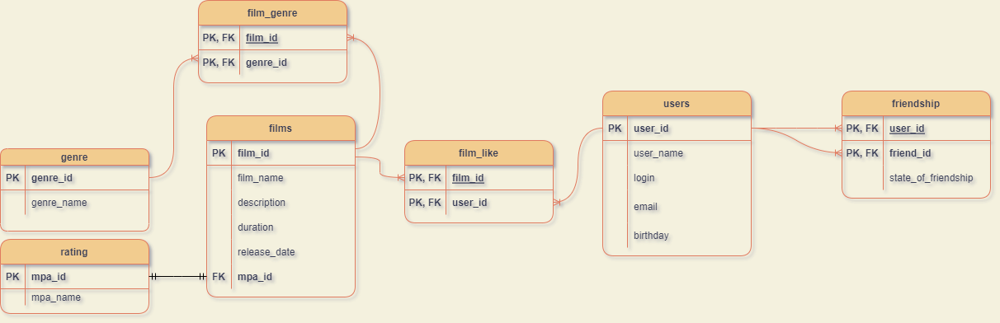

---

Описание проекта
-
Приложение представляет собой социальную сеть для просмотра фильмов по своим предпочтениям и рекомендациям друзей.


Использованные технологии:
-

- Java 11, Maven, Spring-Boot, H2 database, Lombok, JDBC, H2Database

Функционал приложения:
-
Приложение предоставляет возможность:

- Добавлять\редактировать\удалять пользователей\фильмы
- Оставлять отзывы на фильмы
- Оценивать фильмы
- Добавлять\удалять друзей
- Просматривать общих друзей
- Просматривать ленту событий по действиям друзей в соц. сети
- Формировать рекомендации к просмотру фильмов


#### Диаграмма базы данных:


#### Примеры основных запросов:

- Получить фильм с id 5
  ```` SQL
  SELECT *
  FROM film
  WHERE film_id = 5;

- Получить пользователя с id 2
  ```` SQL
  SELECT *
  FROM user
  WHERE user_id = 2;

- Получить 10 самых популярных фильмов
  ```` SQL
  SELECT f.film_id, f.film_name, f.description, f.release_date, f.duration,r.mpa_id, r.mpa_name
  FROM films AS f
  JOIN rating AS r ON f.mpa_id = r.mpa_id
  LEFT JOIN FILM_LIKE AS l ON f.film_id = l.film_id
  GROUP BY f.film_id
  ORDER BY COUNT(l.user_id) DESC
  LIMIT 10;

- Получить друзей пользователя с id 3
  ```` SQL
  SELECT *
  FROM friendship
  WHERE user_id = 3 
  AND state_of_friendship = true;

- Получить всех пользователей
  ```` SQL
  SELECT *
  FROM user;

- Получить все фильмы
  ```` SQL
  SELECT *
  FROM film;

- Получить общих друзей двух пользователей
  ```` SQL
  SELECT * FROM users AS us
  JOIN FRIENDSHIP AS fr1 ON us.user_id = fr1.friend_id
  JOIN FRIENDSHIP AS fr2 ON us.user_id = fr2.friend_id
  WHERE fr1.user_id = ? AND fr2.user_id = ?;